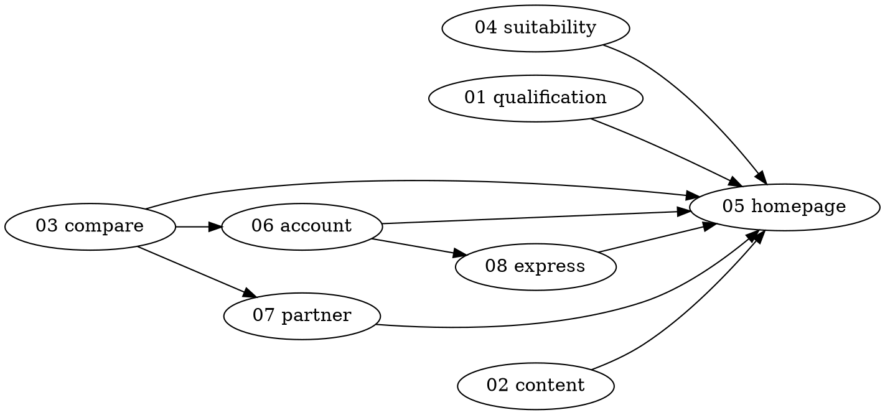

# Refactor Index

> Eight specs to align the SIFcase product with the twelve-question spine.
> Read `../PRODUCT.md` first. Gap ranking and evidence live in `../question-depth-matrix.md`.
> **All specs written against commit `29b97f8` (main), 2026-07-20.**

## Execution order

**File numbers are stable identifiers. They are not the order.** Execute in the sequence below — it follows dependencies, not numbering.

```
1.  04-suitability-restore     ← start here: near-free, machinery already modelled
2.  01-qualification-moment    ← no dependencies, unblocks the Qualified Novice
3.  03-compare-surface         ← blocks 06; also the worst coupling hotspot in the codebase
4.  02-content-consolidation   ← blocks the inline-learning layer
5.  06-account-moment          ← requires 03
6.  07-partner-mode            ← requires 03 (shareable comparisons)
7.  08-express-lanes           ← independent, slot anywhere after 06
8.  05-homepage-spine          ← LAST. It composes all seven others
```



**Why homepage is last:** it composes every other move. Building it first guarantees building it twice. This is the most common sequencing error on a redesign of this shape — the homepage is the most visible surface, so it attracts attention first, and it is the one surface whose correct design is entirely determined by decisions made elsewhere.

## Fidelity tiers

Specs decay at different rates. Each is written at the fidelity its coupling justifies.

| Tier | Meaning | Specs |
|---|---|---|
| **Full** | Complete implementation detail. Low coupling, touches disjoint surfaces, will still read correctly in three months. | `04`, `01`, `07`, `08` |
| **Interface** | Complete intent, data model, public interface, and verification. Internal component layout deferred. | `03`, `02` |
| **Intent** | Complete goals, constraints, and acceptance criteria. Structure deferred to a pre-flight refresh — it depends on choices made in earlier specs. | `06`, `05` |

**Every spec carries a pre-flight checklist.** Run it before implementing. It converts silent staleness into a loud, cheap check.

## Status

| # | Spec | Tier | Depends on | Status |
|---|---|---|---|---|
| 04 | Suitability restore | Full | — | Not started |
| 01 | Qualification moment | Full | — | ✅ Landed 2026-07-20 |
| 03 | Compare surface | Interface | — | Not started |
| 02 | Content consolidation | Interface | — | Not started |
| 06 | Account moment | Intent | 03 | Not started |
| 07 | Partner mode | Full | 03 | Not started |
| 08 | Express lanes | Full | 06 | Not started |
| 05 | Homepage spine | Intent | all | Not started |

## Working agreement

1. **One spec, one branch, one session.** Do not batch specs — the dependency graph exists for a reason.
2. **Re-run the pre-flight before implementing.** If a pre-flight item fails, update the spec before writing code.
3. **Update `../question-depth-matrix.md` when a spec lands.** The matrix is the source of truth for what is covered; a spec that ships without updating it has not really shipped.
4. **Every spec must state its honest exit.** If a change makes it easier for an unsuitable user to convert, it is wrong (`PRODUCT.md` §7.4).
5. Specs at **Intent** tier should be expanded into a full spec by a fresh brainstorming session when their turn arrives — do not implement directly from an Intent-tier spec.
